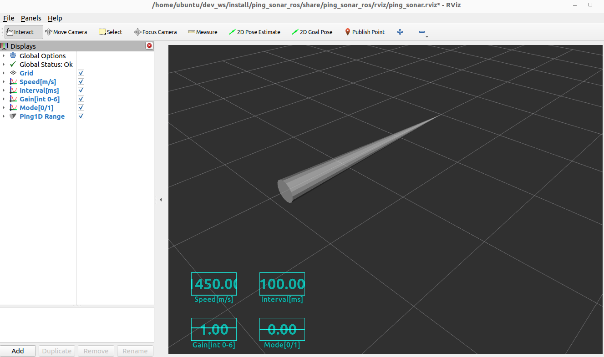

# ping_sonar_ros

[](https://github.com/tasada038/ping_sonar_ros/stargazers/)
[](https://github.com/tasada038/ping_sonar_ros/network/)
[](https://github.com/tasada038/ping_sonar_ros/issues/)
[](https://github.com/tasada038/ping_sonar_ros/blob/master/LICENSE)

## Overview

ROS 2 package for Blue Robotics Ping Sonar Altimeter and Echosounder

**Keywords:** ROS 2, ping sonar

### License

The source code is released under a [MIT license](LICENSE).

## Requirements
[Ping Sonar Altimeter and Echosounder](https://bluerobotics.com/store/sensors-sonars-cameras/sonar/ping-sonar-r2-rp/)

## Installation

Clone with `--recursive` in order to get the necessary `ping-python` library:

```
cd dev_ws/src
git clone -b master --recursive https://github.com/tasada038/ping_sonar_ros.git
cd ~/dev_ws/src/ping_sonar_ros/ping_sonar_ros/ping-python && python3 setup.py install --user
cd ~/dev_ws
colcon build --packages-select ping_sonar_ros
```

## Run
Publish sonar data
```
. install/setup.bash
ros2 run ping_sonar_ros ping1d_node
```

Publish sonar data using Rviz2
```
. install/setup.bash
ros2 launch ping_sonar_ros ping_sonar.launch.py
```



## Ping sonar Topics
The topics of the ping_sonar_ros are as follows.

```
$ ros2 topic list
/ping1d/param/gain
/ping1d/param/interval
/ping1d/param/mode
/ping1d/param/speed
/ping1d/range
```

- std_msgs.msg Float32: /ping1d/param/gain
- std_msgs.msg Float32: /ping1d/param/interval
- std_msgs.msg Float32: /ping1d/param/mode
- std_msgs.msg Float32: /ping1d/param/speed
- sensor_msgs.msg Range: /ping1d/range

## Ping sonar Parameters
The parameters for the ping_sonar_ros are as follows.

```
$ ros2 param list
/ping1d_node:
  gain_num
  interval_num
  mode_auto
  scan_lenght
  scan_start
  speed
```

- gain_num parameter range is [0 - 6] (int).
- interval_num range is [50 - 200] (int, ms).
- mode_auto range is [0 or 1].
- scan_lenght range is [2000 - 10000] (int ms). Blue Robotics Inc. default is 2000 mm.
- scan_start range is [30 - 200]. Blue Robotics Inc. default is 100 mm.
- scan_start range is [1050000 - 1550000] (int mm/s).

## License
This action is licensed under the MIT License. This project is originally created by [Blue Robotics](https://github.com/bluerobotics), and maintained continuously by Takumi Asada.

Projects in .gitmodules files are covered by Blue Robotics Inc's MIT License.
Other software components are licensed under this project's license.